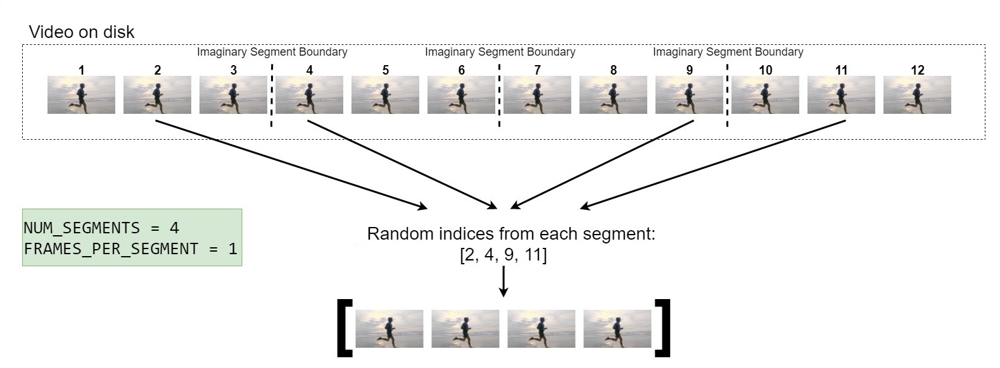

# Pytorch Video Dataloader
In this repository a simple video dataloader in pytorch has been implemented.
In order to test it, you need to run it as below:

`
python dataset.py
`

The VideoFrameDataset class (an implementation of torch.utils.data.Dataset) serves to easily 
and effectively load video samples from video datasets in PyTorch.

1. Easily because this dataset class can be used with custom datasets with minimum effort and no modification.
The class merely expects the video dataset to have a certain structure on disk and expects a .txt annotation file that
enumerates each video sample.
2. Effectively because the implemented sampling strategy for video frames is very representative. 
Video training using the entire sequence of video frames (often several hundred) is too memory and compute intense. 
Therefore, this implementation samples frames evenly from the video (sparse temporal sampling) so that the loaded
frames represent every part of the video, with support for arbitrary and differing video lengths within the same 
dataset. This approach has shown to be very effective and is taken
from [Temporal Segment Networks (ECCV2016)](https://arxiv.org/abs/1608.00859) with modifications.




In conjunction with PyTorch's DataLoader, the VideoDataset class returns video batch tensors of
size BATCH × FRAMES × HEIGHT × WIDTH × CHANNELS (BNHWC).


```python
    data_path = 'samples.csv'

    batch = 2
    training_data = VideoDataset(
        csv_dir=data_path,
        target_size=(320, 200),
        max_frame=80,
        frames_per_segment=1,
        num_segments=80
        )
    train_dataloader = DataLoader(training_data, batch_size=batch, shuffle=False)

    for i, j in train_dataloader:
        i = i.cpu().numpy()
        for sample_number in range(i.shape[0]):
            vid = i[sample_number]
            lab = j[sample_number]

            print('label:', lab)
            plot_video(vid)
```


If you do not want to use sparse temporal sampling and instead want to sample a single N-frame continuous
clip from a video, this is possible. Set `num_segments=1` and `frames_per_segment=1`.
